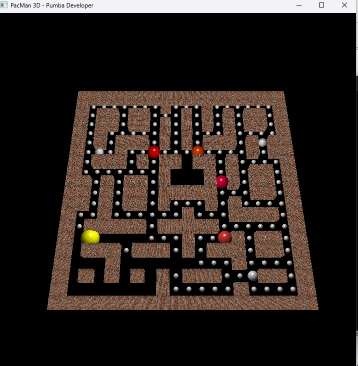

# Pacman 3D - OpenGL




> O projeto tem como objetivo reconstruir o jogo Pacman 3D aplicando os conceitos de Computação Gráfica utilizando a biblioteca OpenGl.

## 👾 Como Jogar

> Utilize w, a, s, d para mover-se pelo mapa.

O objetivo do jogo é coletar todas as moedas presentes no mapa. Mas tenha cuidado, monstros estão andando aleatoriamente pelo mapa para proteger-las. Se eles te pegarem, o jogo acaba.

## 💻 Pré-requisitos

Antes de começar, verifique se você atendeu aos seguintes requisitos:

- [`< Falcon C++ >`](https://falconcpp.sourceforge.net/)
- [`< OpenGL >`](https://www.opengl.org/)

## 🚀 Baixando e Configurando Projeto

> É recomendado abrir o projeto executando o arquivo <strong>Pac-Man 3D.fpj</strong> no Falcon C++. Assim todas as dependências estarão configuradas.

Para instalar o projeto, siga estas etapas:

```
git clone https://github.com/pumba-dev/pac-man-3D.git
```

## ☕ Usando o Projeto

> O projeto irá ler o mapa do arquivo <strong>pacman-map.txt</strong>, os parametros relacionados ao mapa e aos índice dos objetos podem ser redefinidos no código.

Para executar o projeto no Falcon C++, siga estas etapas:

```
Compile (Ctrl + F9)
Run (F9)
```

## 🤝 Colaboradores

Agradecemos às seguintes pessoas que contribuíram para este projeto:

<table>
  <tr>
    <td align="center">
      <a href="https://github.com/pumba-dev">
        <br>
        <sub>
          <b>Eu Mesmo</b>
        </sub>
      </a>
    </td>
  </tr>
</table>

## 😄 Seja um dos Contribuidores<br>

Entre em contato para se tornar um contribuidor.

## 💰 Donate

[](https://picpay.me/pumbadev)

## 📝 Licença

Copyright © 2022 Pumba Developer

[⬆ Voltar ao topo](#pac-man-3D)<br>
